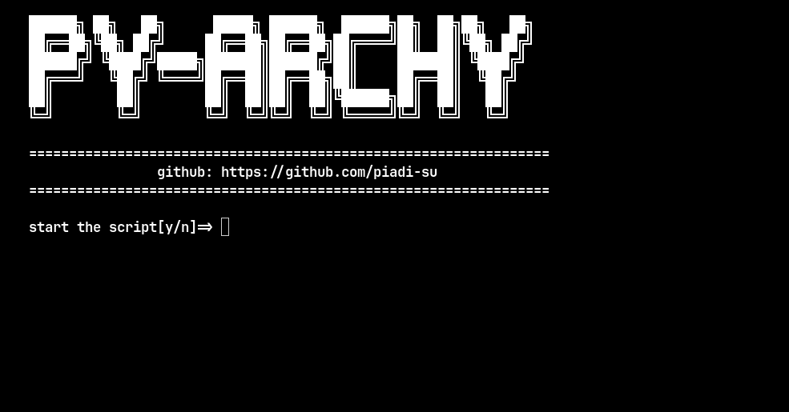

---

# Py-Archy



**Py-Archy** is a modular Arch Linux installation script written in Python. The script is designed to be modular, allowing it to serve as a base for creating a custom installer.

## Key Features

- Modular Arch Linux installation
- Easily extendable for custom projects
- Python-based for flexibility and readability

## Requirements

- Arch Linux Live Environment
- Python 3
- Git

## Usage Instructions

1. Boot into the Arch Linux live environment.

2. Update the repositories:
   
   ```bash
   pacman -Sy
   ```

3. Install git:
   
   ```bash
   pacman -S git 
   ```

4. Clone the repo:
   
   ```bash
   git clone https://github.com/piadi-su/py-archy
   ```

5. Navigate to the project directory:
   
   ```bash
   cd py-archy/src
   ```

6. Move installer to your home directory:
   
   ```bash
   mv installer.py $HOME && cd 
   ```

7. Run the installation script:
   
   ```bash
   python3 installer.py
   ```

## Notes

License: This project uses a permissive license (MIT License), allowing free use, modification, and redistribution.
